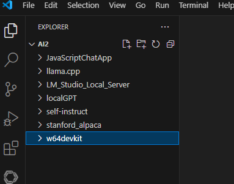
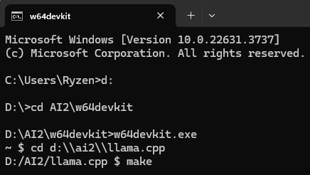
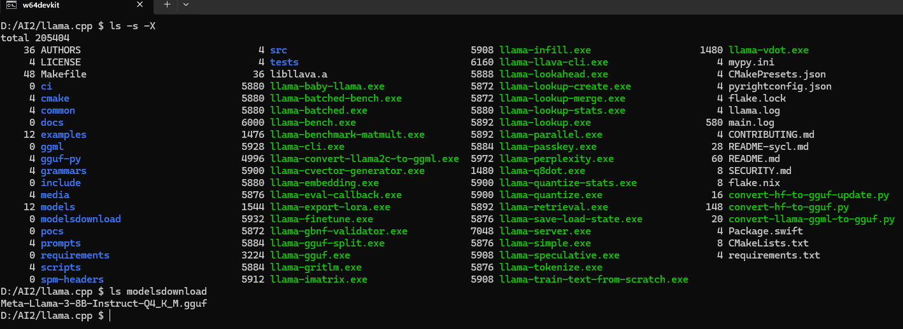
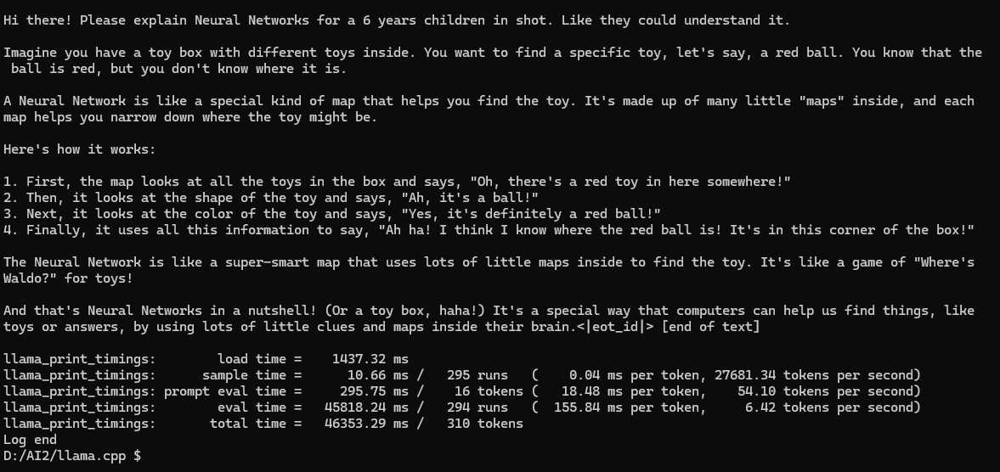
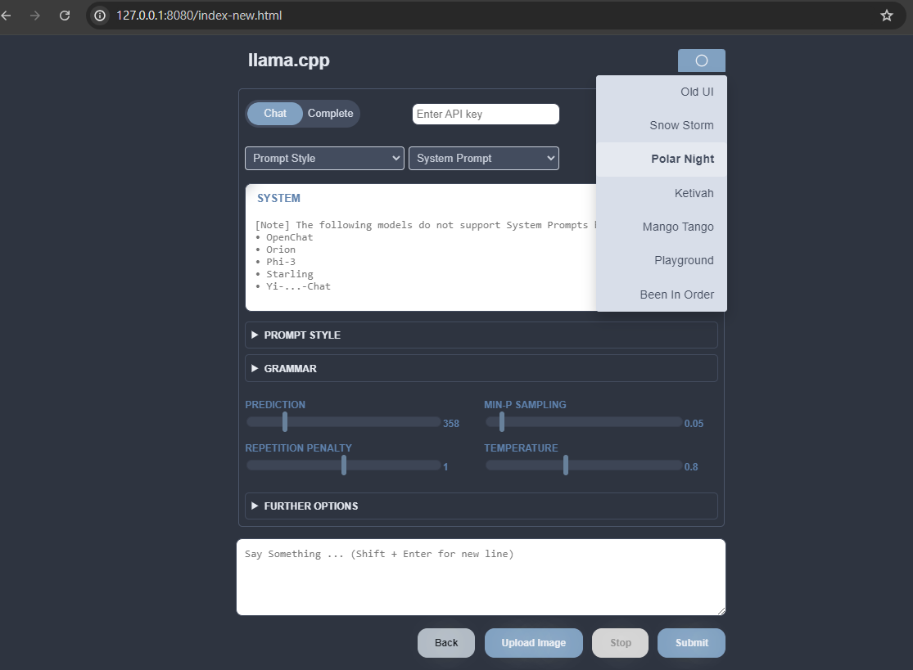
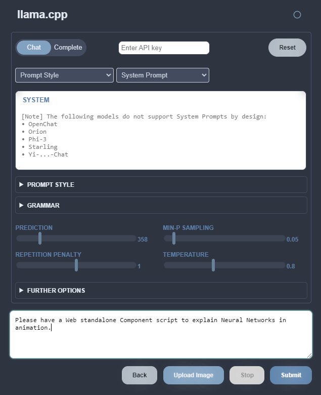

# LLM Deployment

* [Source](https://github.com/ggerganov/llama.cpp): llama.cpp

* This repository is intended for environments without CUDA on Windows.

* The instructions for inference usage can be found in this README file. You can find a fine-tuning example below.

* [llama-finetune example](https://github.com/AlleninTaipei/LLM-Deployment/blob/main/Finetune%20Example.md)

## Download Compiler

I use the Makefile method to compile (because I am not familiar with CMake), download the [w64devkit](https://github.com/skeeto/w64devkit/releases/download/v1.21.0/w64devkit-1.21.0.zip) compilation environment from GitHub. Unzip the Zip file and place it in a directory.



## Get the Code

```bash
git clone https://github.com/ggerganov/llama.cpp
```

### Run w64devkit to compiler

Change directory to `llama.cpp`

Compiler `llama.cpp` with `make`



## Check compiler result

* [Shell Command](https://github.com/AlleninTaipei/LLM-Deployment/blob/main/Shell%20Command.md)

`ls -s -X`



The EXE files highlighted in green are the build results, while the blue ones indicate the original directories from the original `llama.cpp`  repository.

I added a directory (modelsdownload) and copied a LLM named `Meta-Llama-3-8B-Instruct-Q4_K_M.gguf` into it. I used that Llama model in LM Studio. I'm planning to use it to demonstrate LLM deployment in the following usage examples.

## Get help 

Use -h, --help, --usage to print usage.

```bash
./llama-cli.exe -h
```
## Command Line

```bash
./llama-cli -m modelsdownload/Meta-Llama-3-8B-Instruct-Q4_K_M.gguf -p "Please have one joke about artificial intelligence."
```



## Local Server

`llama.cpp` also provides the function of setting up a server. You can access the model through the HTTP API. You ./llama-server can quickly set it up by using it. By default http://127.0.0.1:8080/, an LLM Service will be opened. 

```bash
./llama-server -m modelsdownload/Meta-Llama-3-8B-Instruct-Q4_K_M.gguf
```





## Additional information

* [llama.cpp - Quantization](https://github.com/AlleninTaipei/LLM-Deployment/blob/main/llama.cpp%20-%20Quantization.md)

@misc{llama.cpp,
  title = {llama.cpp},
  url = {https://github.com/ggerganov/llama.cpp},
}