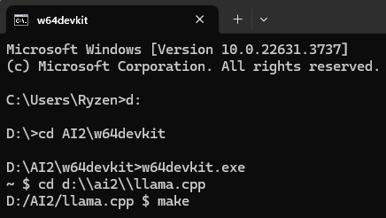

# LLM Deployment

This repository is intended for individuals who are not familiar with machine learning (ML), deep learning (DL), artificial intelligence (AI), or computer science (CS) to gain a general understanding of LLM deployment.

In the summer of 2023, I attended the National Taiwan University's Information Systems Training Course to participate in Python Programming and HTML5/CSS3/JavaScript classes. I enrolled in these courses because I recognized that the AI era is approaching, particularly with the release of GPT-3.5 by OpenAI on November 30, 2022. After that, I learned about [PromtEngineer/localGPT](https://github.com/PromtEngineer/localGPT) from a YouTuber named [VideotronicMaker](https://www.youtube.com/@videotronicmaker). I then sought to understand how to access the code from GitHub. I tried running localGPT in [VSCode](https://code.visualstudio.com/), asking OpenAI ChatGPT for an example of a Flask web application to chat with the LM Studio local server. I also requested a simple Python example from Anthropic Claude to perform basic interactions with a local language model. Get up and running with large language models with [Ollama](https://ollama.com/).

Currently, I am gaining experience in understanding [llama.cpp](https://github.com/ggerganov/llama.cpp/tree/master).

## Usage

This repository is intended for environments without CUDA on Windows.

### Download 

I use the Makefile method to compile (because I am not familiar with CMake), download the [w64devkit](https://github.com/skeeto/w64devkit/releases/download/v1.21.0/w64devkit-1.21.0.zip) compilation environment from GitHub. Unzip the Zip file and place it in a directory.


### Get the Code

```bash
git clone https://github.com/ggerganov/llama.cpp
```

### Run w64devkit to compiler

Change directory to `llama.cpp`

Compiler `llama.cpp` with `make`



### Check compiler result

`ls -s -X`


The EXE files highlighted in green are the build results, while the blue ones indicate the original directories from the original `llama.cpp`  repository.

I added a directory (modelsdownload) and copied a LLM named `Meta-Llama-3-8B-Instruct-Q4_K_M.gguf` into it. I used that Mistral model in LM Studio. I'm planning to use it to demonstrate LLM deployment in the following usage examples.

### Get help 

Use -h, --help, --usage to print usage.

```bash
./llama-cli.exe -h
```
### Command Line

```bash
./llama-cli -m modelsdownload/Meta-Llama-3-8B-Instruct-Q4_K_M.gguf -p "Hi there! Please explain Neural Networks for a 6 years children in shot."
```


### Local Server

`llama.cpp` also provides the function of setting up a server. You can access the model through the HTTP API. You ./llama-server can quickly set it up by using it. By default http://127.0.0.1:8080/, an LLM Service will be opened. 

```bash
./llama-server -m modelsdownload/Meta-Llama-3-8B-Instruct-Q4_K_M.gguf
```


